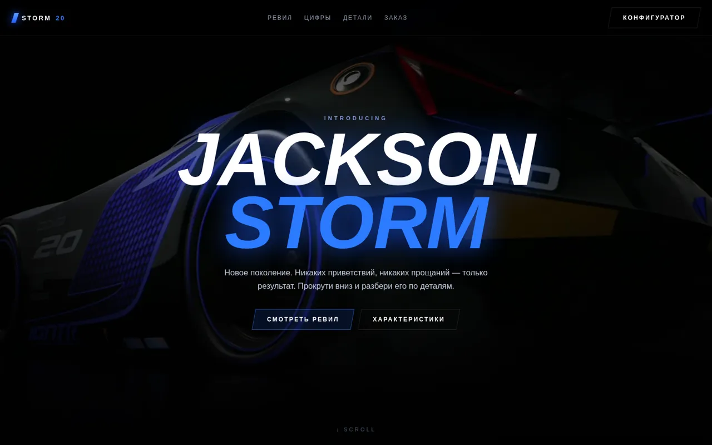

# jackson-storm

**English** · [Русский](docs/README.ru.md)

A scroll driven reveal page: the visitor scrolls, and the page scrubs a video frame by frame
so the car assembles itself detail by detail (the effect Porsche and Apple use on product pages).
Fan concept built on footage from the "Cars 3" trailer.




## Live page

GitHub Pages: `https://topicspot.github.io/jackson-storm/`
(enable it once in Settings, see [Deploy](#deploy)).

Local: open `index.html` in a browser. No build step, no dependencies, no server needed.

## How it works

The reveal is a `<video>` element that is never played. A scroll listener maps scroll position
inside a tall sticky section to `video.currentTime`, so the frame follows the scrollbar:

```
progress = (scrollY - sceneTop) / (sceneHeight - viewportHeight)
video.currentTime = progress * video.duration
```

Two details make it usable in practice:

* **Smoothing.** The raw progress value is eased toward the target inside a
  `requestAnimationFrame` loop, otherwise seeking looks jumpy on trackpads.
* **iOS priming.** Safari refuses to render seeked frames until a video has been played once,
  so the page calls `play()` and immediately `pause()` on the first touch or click.

Eight captions are tied to progress thresholds (wheel, edges, wing, cockpit, charge, number 20,
exhaust, full view) and fade in as the matching part of the car appears on screen.

## Repository layout

```
index.html                  the whole page: markup, CSS and the scroll logic
assets/storm-reveal.mp4     1920x1080, 20 fps, 21.9 s, keyframe every 10 frames
assets/hero.webp            hero still, 1920 px wide
assets/detail-0{1,2,3}.webp gallery stills, 1400 px wide
assets/og-preview.webp      social preview image
scripts/build-assets.sh     regenerates every asset from the source video
docs/README.ru.md           Russian version of this file
```

## Rebuilding the assets

The video is prepared for seeking, not for playback. Dead frames between trailer shots are cut
out, the result is graded and sharpened, and the keyframe interval is kept short so a browser
can jump to any moment without decoding a long GOP.

```bash
scripts/build-assets.sh path/to/source.mp4
```

Key encoder settings and the reason for each:

| Setting | Value | Why |
| --- | --- | --- |
| `-g` | 10 | short GOP, so seeking lands on a keyframe quickly |
| `fps` | 20 | the user drives the timeline, so spare frames only cost bytes |
| `-crf` | 22 | quality first, the page loads assets separately and has no size cap |
| `eq` + `unsharp` | baked in | grading in the encode instead of a CSS `brightness()` filter, which amplifies compression noise |
| `-movflags` | `+faststart` | the moov atom goes first, so seeking works before the file is fully loaded |

## Deploy

GitHub Pages, Settings -> Pages -> Source: "Deploy from a branch", branch `main`, folder `/`.
Nothing else is required, the page is fully static.

Any static host works the same way: upload `index.html` and `assets/` and you are done.

## Notice

Fan concept, non commercial. Jackson Storm and all footage in `assets/` come from the
"Cars 3" trailer and remain the property of Disney and Pixar. The page code is published
under the MIT license (see `LICENSE`), the media files are not covered by it and are included
for personal and portfolio use only.
